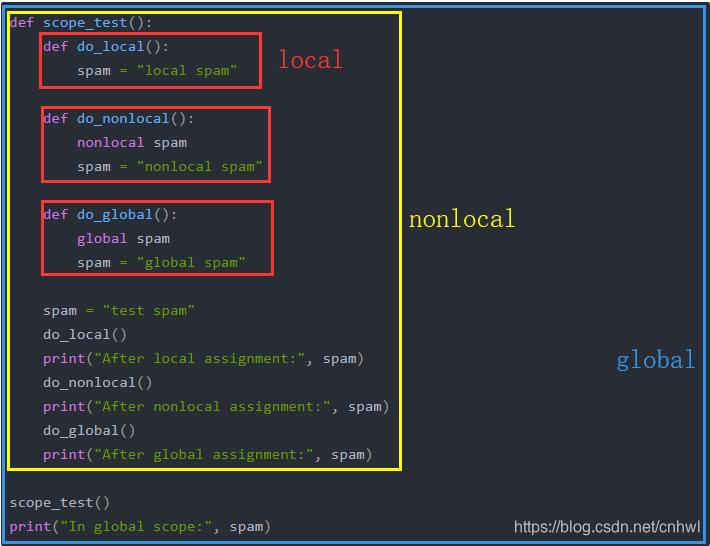

# Python Class

> - 类提供了把数据和功能绑定在一起的方法。</br>
> - 创建新类时创建了新的对象类型，从而能够创建该类型的新实例。实例具有能维持自身状态的属性，还具有能修改自身状态的方法（由其所属的类来定义）。[^1]

## 一：Class 命名空间

严格来说，对模块中名称的引用是属性引用：表达式 modname.funcname 中，modname 是模块对象，funcname 是模块的属性。
模块属性和模块中定义的全局名称之间存在直接的映射：它们共享相同的命名空间！

### global 和 nonlocal 语句

> - 当一个函数或类的定义嵌套（被包围）在其他函数的定义中时，其非局部作用域就是包围它的函数的局部作用域 。
> - 在 global 语句中列出的名称不得在同一代码块内该 global 语句之前的位置中使用。

下面是global和nonlocal语句的例子：

```python
def scope_test():
    def do_local():
        spam = "local spam"

    def do_nonlocal():
        nonlocal spam
        spam = "nonlocal spam"

    def do_global():
        global spam
        spam = "global spam"

    spam = "test spam"
    do_local()
    print("After local assignment:", spam)
    do_nonlocal()
    print("After nonlocal assignment:", spam)
    do_global()
    print("After global assignment:", spam)

scope_test()
print("In global scope:", spam)
```

输出为：

---

- After **local** assignment: test spam
- After **nonlocal** assignment: nonlocal spam
- After **global** assignment: nonlocal spam
- In **global** scope: global spam
- 🤗🤗🤗🤗🤗🤗🤗

---

图片解释如下：


> - 现在，大多数命名空间都使用 Python 字典实现，但除非涉及到性能优化，我们一般不会关注这方面的事情，而且将来也可能会改变这种方式。[^2]

## 二：Class 属性

[^1]: [Class](https://docs.python.org/3/tutorial/classes.html#class-objects)
[^2]: [NameSpace](https://docs.python.org/zh-cn/3/tutorial/classes.html#python-scopes-and-namespaces)
